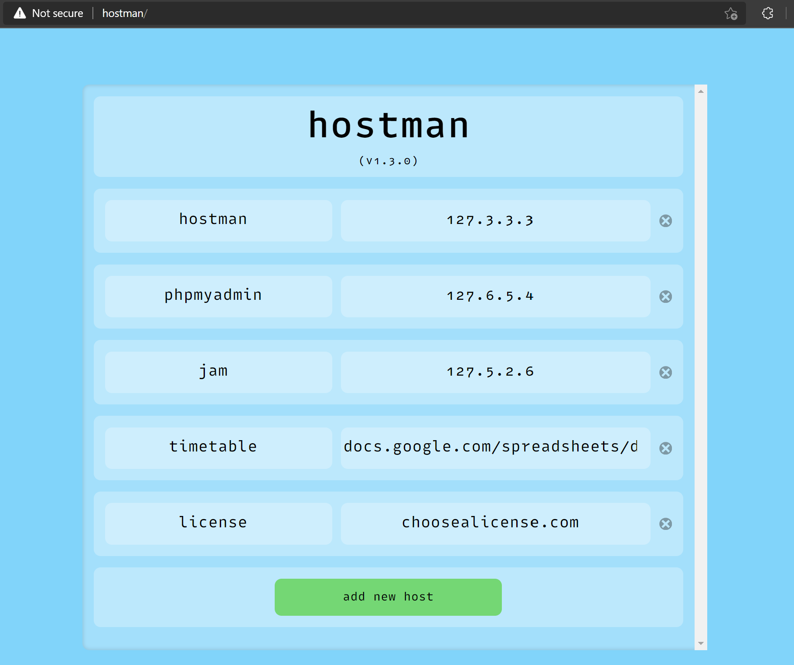

# hostman

Hostman is an easy to use web app that allows you to manage your hosts file without the hassle of finding it, opening it, changing, saving and continuing on with life. Instead, you navigate to `http://hostman/` (or just `hostman/`) and add in your hostname and IP address!



## Motivation

The motivation for this project is quite simple, and likely one that you can sympathise with: I just want to use hostnames instead of IP addresses when I'm spinning local dev servers.

The one extra thing that hostman can do though, is bind a hostname to a fully resolvable URL! So if you want to, you can point `http://yt` to `https://youtube.com`, or `http://git/` to `https://github.com`! Most browsers even accept `url/` as a valid URL!

## Installation

```console
$ npm install -g @thebrenny/hostman
```

Hostman will bind itself to `127.3.3.3` upon install, but to do that it needs to have [access to sudo/Admin](#sudo). Once accepted and hostman is installed globally, you can spin up the hostman server by typing `hostman` at the terminal. Doing this manually can keep you more secure as the server is run at your level, with `sudo-prompt` asking if you want to modify the host file each and every time.

Otherwise, if you want to take the risk, you can also create a service for hostman by running `hostman build-service`.This will ensure that hostman is up no matter when you might need it.

## Sudo

All sudo/Admin requests are handled through `sudo-prompt` and all actions that modify the actualy hosts file are handled through `hosts-etc` (also checkout `hosts-etc-cli`!).

## Contributing
Pull requests are welcome. For major changes, please open an issue first to discuss what you would like to change.

Please make sure to update tests as appropriate.

## License
[MIT](https://choosealicense.com/licenses/mit/)